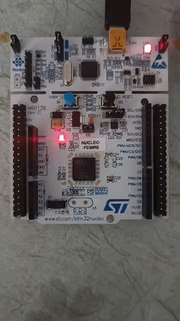

# 01 - LED Blink (HAL)

## A Quick Overview


## What it does
Blinks the onboard LED (LD2, on pin PA5)

## How
Project generated via STM32CubeMX / STM32CubeIDE ("STM32Cube" project type),
PA5 configured as `GPIO_Output` in the `.ioc` pinout.

The only application code written by hand, inside `main()`'s `while(1)` loop:

```c
while (1)
{
    HAL_GPIO_TogglePin(GPIOA, GPIO_PIN_5);
    HAL_Delay(1000);
}
```

## The Black Boxes of CubeMX/HAL
- Everything is set by the magical black boxes of auto-generated drivers and the startup code.
- At first glance writing two lines of code to blink an LED seems pretty easy and doesn't explain anything about what's going on under the hood. How the memory addresses defined, the clock signal enabled or the register addresses set. It doesn't explain how the Cortex-M0 knows exactly which register's specific bit to manipulate when I tell it to toggle some pin. The only thing I've done in this project was using two predefined functions that set the PA5's bit high/low in 1 second frequency. In the next two projects, I'll go deeper and try to make the configurations on my own rather than leaving it to the CubeMX.

- The Mentioned **Black Boxes** in the main() function before the while(1) loop:

```c
  /* Reset of all peripherals, Initializes the Flash interface and the Systick. */
  HAL_Init();

  /* Configure the system clock */
  SystemClock_Config();

  /* Initialize all configured peripherals */
  MX_GPIO_Init();
```

## Notes
- Looked into MX_GPIO_Init() black box only to find another but a tinier **black box**:

```c
  /* GPIO Ports Clock Enable */
  __HAL_RCC_GPIOA_CLK_ENABLE();
```

Diving even deeper to find the truth:

```c
#define __HAL_RCC_GPIOA_CLK_ENABLE() do { \
    __IO uint32_t tmpreg; \
    SET_BIT(RCC->AHBENR, RCC_AHBENR_GPIOAEN); \
    tmpreg = READ_BIT(RCC->AHBENR, RCC_AHBENR_GPIOAEN); \
    UNUSED(tmpreg); \
} while(0)
```

The actual bottom of this blackbox is **RCC->AHBENR |= RCC_AHBENR_GPIOAEN** --this is going to be the main topic in project 02.