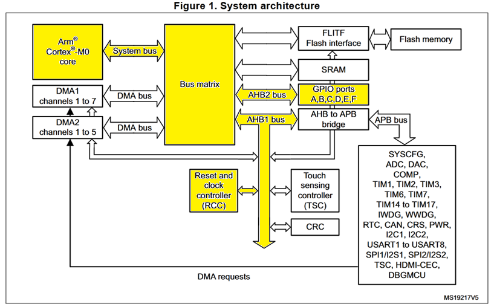
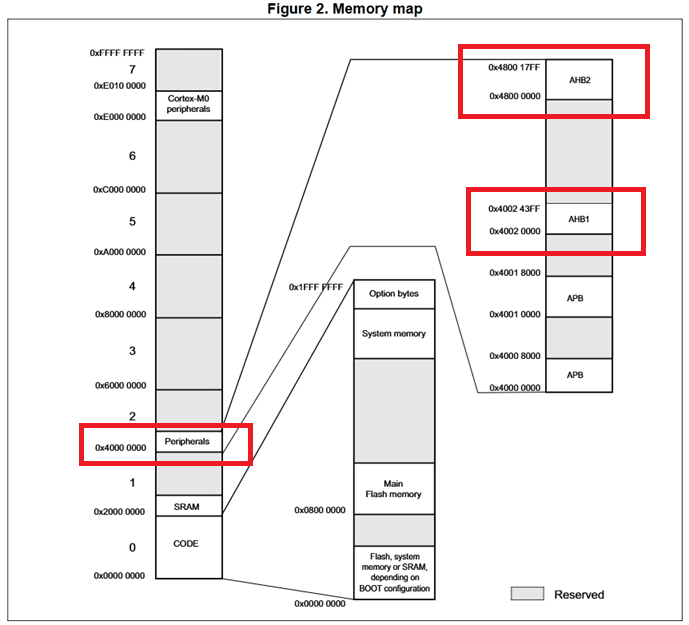
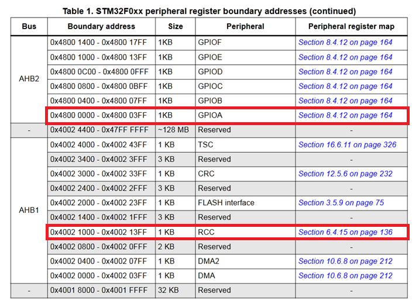
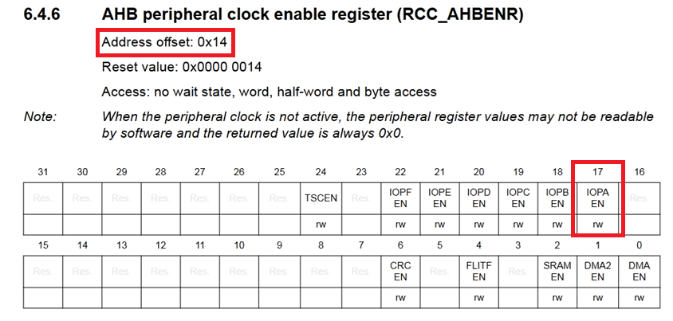
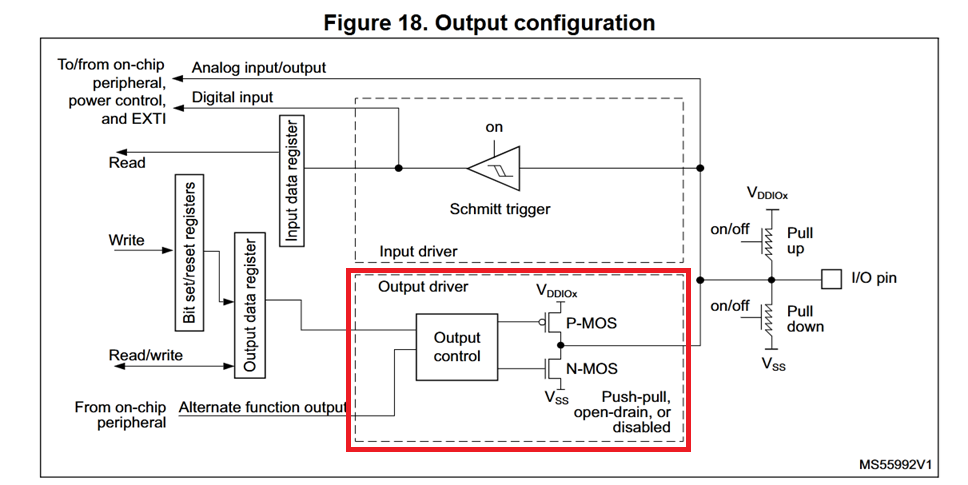
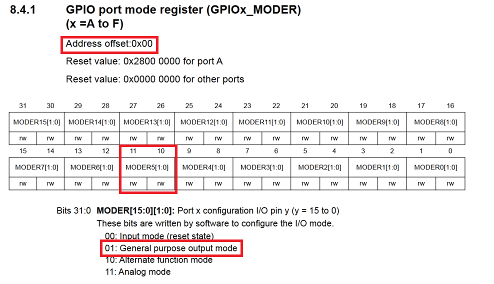
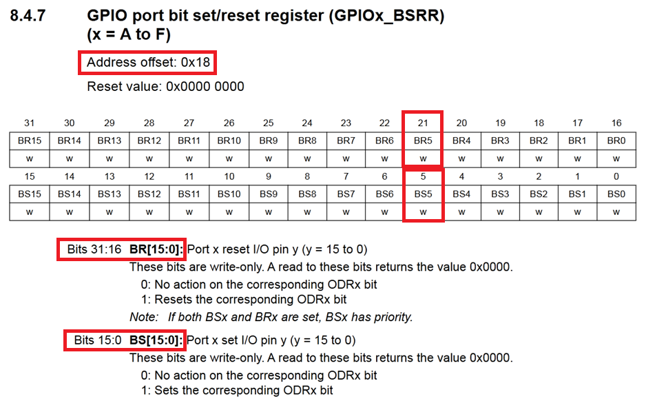

# 02 - LED Blink (Register Level)

## A Quick Overview


## What It Does
Blinks the onboard LED (LD2, on pin PA5)

## How

The initial main.c file that's auto-generated by IDE was like this:

```c
    #include <stdint.h>

    #if !defined(__SOFT_FP__) && defined(__ARM_FP)
    #warning "FPU is not initialized, but the project is compiling for an FPU. Please initialize the FPU before use."
    #endif

    int main(void)
    {
        /* Loop forever */
        for(;;);
    }
```

Then, I've written some code by hand, inside `main.c` source file:

```c
    /* ---- Register address definitions (manually derived from RM0091) ---- */
    #define RCC_BASE 0x40021000UL
    #define AHBENR_OFFSET 0x14UL
    #define RCC_AHBENR (*(volatile uint32_t *)(RCC_BASE + AHBENR_OFFSET)) /* 0x40021014 */
    #define RCC_AHBENR_GPIOAEN (1U << 17)

    #define GPIOA_BASE 0x48000000UL
    #define MODER_OFFSET 0x00UL
    #define BSRR_OFFSET 0x18UL
    #define GPIOA_MODER (*(volatile uint32_t *)(GPIOA_BASE + MODER_OFFSET))
    #define GPIOA_BSRR (*(volatile uint32_t *)(GPIOA_BASE + BSRR_OFFSET))


    int main(void)
    {
        // Enable GPIOA clock gate by setting the IOPAEN bit high (17th bit of RCC_AHBENR register)
        RCC_AHBENR |= RCC_AHBENR_GPIOAEN;

        // Configure GPIOA PA5 (The exact pin for LED) in "general purpose output mode"
        GPIOA_MODER &= ~((1U << 10) | (1U << 11)); /* clear the bits by setting them "0" */
        GPIOA_MODER |= (1U << 10); /* Configure the pin as output (01) */

        /* Loop forever */
        for(;;){
            // Set PA5 pin high
            GPIOA_BSRR = (1U << 5);

            // crude busy-wait delay - NOT calibrated to real time, duration depends on clock speed
            for(volatile uint32_t i = 0; i < 200000; i++);

            // Set PA5 pin low
            GPIOA_BSRR = (1U << (5 + 16)); /* Register's first 16 bit -> set, last 16 bit -> reset*/

            // crude busy-wait delay - NOT calibrated to real time, duration depends on clock speed
            for(volatile uint32_t i = 0; i < 200000; i++);
        }
    }
```

Don't be scared, I'll walk you through every line as we uncover the underlying truth.

### What Is A Register And What Are These Magical (0x40021000UL) Numbers
A register is simply a small storage location to stash bits. Each bit controls a specific hardware feature. It's built with transistors (flip-flops or latches) in pure silicon. Everything comes down to silicon in this world. We use these fancy friends (registers) to manipulate this silicon world. When this chip was manufactured, every single register was assigned to a **specific address** (a magical number like 0x40021000). Let's look at the system architecture first.

### System Architecture


I highlighted the subsystems which our code touched. We don't need to understand everything right now as we only blink an LED which is connected to the GPIOA port 5.

- Arm Cortex M0 core is the CPU core (wow! ingenious.)
- System bus and bus matrix are just there to carry over the read/write transactions as intended between the CPU, memories and peripherals.
- There are two Bus types here as you can see, AHB and APB. Simply, AHB (Advanced High-Performance Bus) is the bus pro-max, where APB (Advanced Peripheral Bus) is the light version that connects slower hardware. Both work but one is faster and has higher bandwidth. We only used AHB type in this project.
- RCC (Reset and Control Clock) was involved, because we needed it to enable the GPIO clock that lets our GPIOA pin functions. The default state of these clock gates is almost always locked. Without it the port is just asleep, to save power.

### Diving Deep Into Registers
If we want to blink this LED, we first need to enable the GPIO clock on its way. But, how do we find the exact address of this gate? Well, here comes the reference manual RM0091.

- This is a general overview of the memory addresses in our chip.


- I marked the much-needed sections in cute little red boxes. All we need to do is to access RCC over AHB1, and GPIOA over AHB2. Simple as that.


- Now we know the exact memory addresses (register addresses) of RCC and GPIOA. But we need to continue even further to know which exact pinpoint address (register) we need to manipulate...

### Enabling The Clock Gate
- It's not magic anymore. It's pure address numbers.



- We now know that, the offset is "0x14". Which basically means we need to add this offset to the base address of RCC --which was 0x4002 1000, check the previous figure. So, if we try to manipulate the exact "0x4002 1014" hex address, we touch the RCC_AHBENR register. AHBENR (AHB enable register). This is the locked clock gate I mentioned just a section earlier.

- All we need to do is to manipulate the IOPAEN bit high to enable the GPIO clock. Which is, as you can see in the latest figure, 17th bit of the RCC_AHBENR register. To touch that exact address, 17th bit, we need to know a standard bit manipulation technique (bitwise operators).

### Bit Manipulation
- In the code snippet I shared at the top of this README file, you can see a few macros I've written such as 0x14UL or (1U << 17).

- Briefly, UL means "Unsigned Long", it tells the compiler that this exact hexadecimal number is an unsigned long. It avoids signed/unsigned conversion issues and makes it as clear as a crystal that this is a **long** value.

- On the other hand, (1U << 17) means that we shift the "unsigned" binary number "1" left by 17 positions. 17 positions to create a value with only bit 17 set, the exact same bit of our RCC_AHBENR register's IOPAEN pin. So we only touch that 17th bit inside the RCC_AHBENR register.

```c
    RCC_AHBENR |= RCC_AHBENR_GPIOAEN; /* Enable GPIOA clock gate by setting the IOPAEN bit high (17th bit of RCC_AHBENR register) */
    GPIOA_MODER |= (1U << 10); /* Configure the pin as output (01) */
```

- inside the main function, we use some standard bitwise masks to manipulate the exact register addresses as desired to complete this holy task of blinking the onboard LED. I'm not going to explain bitwise operators here, I just hope you're already familiar with it.

### Setting The Port
- Now that we enabled the GPIO clock that connects our cute pin to the whole bus matrix, we must configure it. In order to do that, I looked into the reference manual and found a schematic that sums up how an IO port pin works.



- We'll only be using the bottom output section, to achieve such state we need to manipulate the GPIOx_MODER register. It's designed for this exact purpose. Here's the layout of GPIOx_MODER register.



- To obtain the address of GPIOx_MODER register, we use (GPIOA base address + specific register offset). Which is, (0x48000000UL + 0x00UL).
- We configured our PA5 pin (the LED), MODER5 in this case, by setting the 10th bit as "1" and 11th bit as "0" in our main.c file. It is the general purpose output mode as shown in the figure.

```c
	// Configure GPIOA PA5 (The exact pin for LED) in "general purpose output mode"
	GPIOA_MODER &= ~((1U << 10) | (1U << 11)); /* clear the bits by setting them "0" */
	GPIOA_MODER |= (1U << 10); /* Configure the pin as output (01) */
```

- We already know that, from the NUCLEO documentation itself, that our LED is connected to "PA5" pin by default --I almost forgot to mention this... Well, at least now we know. The board is manufactured that way. All we need to do is to set this PA5 pin as output --we just did it. And after that we will be able to blink the LED by driving the pin high and low.

### GPIOx_BSRR Register
- There are two different registers to manipulate the data of a pin, we are going to use the more efficient one for our task. I'll explain the difference later under this section. The one register we will use is the BSRR register. It's a write only register, meaning we can't read from this register and only write to it.



- To reach the address of this register, we do the same thing we always have done. GPIOA base address + register offset. 0x48000018UL is the address of this register.

- This 32-bit wide register is divided into two different functionalities, the first half is to set a bit value. The other half, which is from 16th to 31st bit, is used to reset a value. Very simple. Set means 1, reset means 0. So we only need the BS5 and the BR5 bits. Since we know the exact address of this register, we only need to manipulate the 5th and the (5+16)th bit of the register. 5th being BS5 and (5+16)th being BR5.

```c
	GPIOA_BSRR = (1U << 5); /* Set the pin high */
    GPIOA_BSRR = (1U << (5 + 16)); /* Set the pin low */
```

- The second way was using GPIOx_ODR (output data register) to set/reset the register value. This is a read/write register, it actually stores the output state unlike BSRR. Which means if we are to use this register to set/reset a bit, we will be doing three things in order. Read from the register and get the value, execute the modification as desired in the bit-mask operation, write the result to the register. Though BSRR directly writes to it and doesn't really care about anything else.

- For that exact reason we didn't use the bit-mask operation we have previously on other registers. We only set the values just like that with the assignment "=" operator in the code.

- This is not really important for such tasks like blinking an LED, though it's the standard way of doing things and in complex projects this difference might be more than really important. Check race condition.

### The Delay For The Blink
- I've heard there are better ways for a precise, determined delay. Using systick or hardware timers. Well, this simple project was all about the registers and IO map addresses. so I only used a simple software delay (a for loop) that delays my CPU to create the holy blink.

```c
    for(volatile uint32_t i = 0; i < 200000; i++);
```

### Other GPIOA Configurations
- There are several important behaviours of registers. In order to manipulate those behaviours/functionalities, we have several important registers. Such as GPIOx_OTYPER (output type register), GPIOx_OSPEEDR (output speed register), GPIOx_PUPDR (pull-up/pull-down register), GPIOx_IDR (input data register), GPIOx_ODR (output data register) and so on.

- We didn't touch any of these except GPIOx_MODER. You may ask why. Well, all of these registers come with a default state (reset value). And when I checked their reset values, I noticed that they are all the values I want them to be. There wasn't any need to change them so I didn't touch any of it.

## Notes / Small Details
- This is a 32-bit microcontroller, every register is 32-bit wide. The CPU can generate addresses up to $2^{32}$. And, from 0 to $2^{32}$ there are 4 GB of addressable space. But physically we don't have that much space, we actually have less than 100KB in our board. That explains the reserved areas in memory map figure. If a pointer somehow tries to read/write from these reserved address blocks, the CPU goes into **hard fault** mode.

- Since this is a 32-bit system, every offset is spread by 4 bytes (32-bits), notice the offsets go like 0x00, 0x04, 0x08. The reason for that is every register is 32-bit wide.


### The Volatile Keyword
- While defining the macros and addresses, we used the volatile keyword. This keyword happens to be extremely important. The compiler normally optimizes the code to make it run faster --though sometimes that optimization is not what we want. For example, Compiler might think a value at a memory location cannot change, it may read it once and reuse that same value instead of reading from the memory again. This is super cool. But! In our silicon world, register values might change due to external conditions. Even writing to them may have side effects. **volatile** tells the compiler that every read and write matters. It must never cache the register values in a CPU register for optimization and always visit the memory where these exact registers live.

### Failed Attempts And Debugging Process
- I first tried to use bit-mask operations for the BSRR register. It did not work, nothing happened. I just sat there silently in front of my non-blinking LED for a few seconds.

```c
	GPIOA_BSRR &= ~(1U << 5); /* Set the pin high */
    GPIOA_BSRR &= ~(1U << (5 + 16)); /* Set the pin low */
```

- Then I asked AI (hey, what could possibly have gone wrong here?), and it told me that, I stupidly used a bit-mask operation for a write-only register instead of a simple assignment "=" operator. Not only that, the bit mask I tried actually didn't set the pin high...

## The Final
- Our LED finally blinks. Not because of HAL nor magic. Just because we understood what lives behind those hexadecimal addresses.

- But this doesn't explain everything yet. How the silicon boots-up? What happens before main() is ever called? How do we use the hardware timer to blink the LED instead of wasting CPU cycles in a busy-wait loop? What happens exactly in that linker script? Let's uncover these in project 03.

On to the next black box.

Written by a human.
Furkan Şafak