# 03 - LED Blink Boot (Custom Startup Boot)

## About The Project
Ever wondered what really happens before main() function is ever called? This project demonstrates the complete build and the boot process.

- Blinking the LED was never the primary focus. It simply serves as a visual proof that our custom boot process works just fine.

That being said, in order to reveal what is hidden behind main() function, let's visit the build process first.

## What IDE hides from us
Clicking "Build" almost feels magical. A few seconds later an executable appears, ready to be flashed onto the target device. In this project there will be no IDE use.

- Most of the building process is completely hidden behind the IDE (to be fair, that's what they are for).

### 1st Step: The Build Process
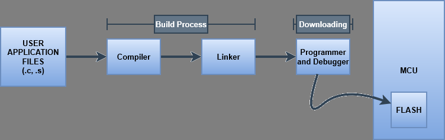

- CPU only understands one thing: machine instruction. These instructions appear to be in binary format. The compiler, assembler and the linker all work together to translate our source files into an instruction stream (0s and 1s). This stream is then fetched by the CPU from FLASH memory. In order to create these machine instructions, we first need to "build" our source files.

- Building Process consists of compiling and linking stages:

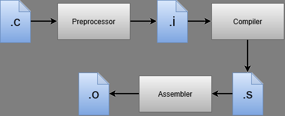

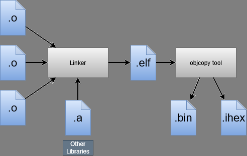

The IDE automates the following steps in the previous figures:
1) Preprocess the C source files (.c -> .i)
2) Translate the preprocessed C code into assembly (.i -> .s)
3) Assemble the assembly code into relocatable object files (.s -> .o)
4) Link all object files together using the Linker and the linker script to produce an ELF file (Executable and Linkable Format)
5) Convert the ELF executable into raw binary image (.elf -> .bin/.ihex)
6) Flash the binary image into the microcontroller using OpenOCD and ST-LINK

### Output Files
Here is a breakdown of each file generated during build process:

**.i** : Preprocessed C file. Generated by the preprocessor.
- Included header files are dumped into the source, "#define" macros are replaced with actual content, comments are stripped out. 

**.s** : Assembly language file. Generated by the compiler.
- Human-readable assembly code for the target device.

**.o** : Relocatable object file. Generated by the assembler.
- Contains binary machine code (0s and 1s) and relocation information. The address of a referenced function that is in another object file can not be known YET. That's why it is called "relocatable". We will later "link" these object files using a linker.

**.elf** : Executable and Linkable Format. Generated by the linker.
- The complete executable. The linker maps all .o files using a linker script and assigns absolute memory addresses. It also includes debug information.

**.bin** : Raw binary file. Generated by the "objcopy".
- The polished machine code with zero metadata, headers, or debug symbols. This is the exact byte-for-byte stream that lives inside target device FLASH memory.

**.map** : Generated by the linker. (Wl,--Map=mapfile.map)
- Human readable text file generated during linking process for feedback. It displays the system memory usage and each component address, the map.

## 2nd Step: What Happens on Reset/Power-up?
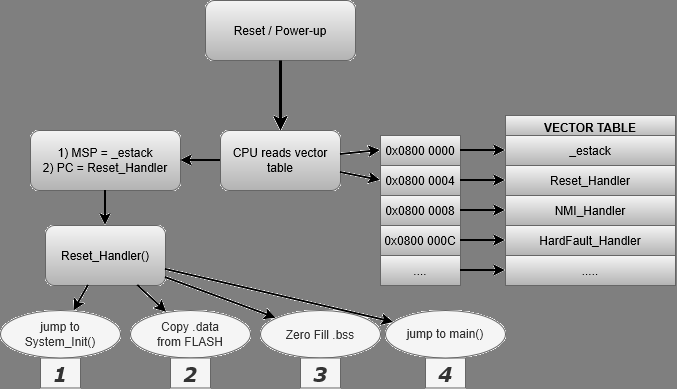

- There is not much happening actually, barely enough to prepare the environment and wake up the system.

### The Main Stack Pointer
- This is the very first thing that happens on reset/power-up. The CPU looks at the first entry of the vector table, fetches the data, loads it into the Stack Pointer. Now our stack is alive!

### The Reset_Handler
- Just after setting the SP, the CPU then immediately checks the second entry of the vector table. Which appears to be the Reset vector itself. The value inside this vector is the address of the Reset_Handler() function.
- The Reset_Handler, as you can foresee from its name, handles the reset. It prepares the runtime environment for us:

- First it calls the System_Init function which sets the Clock Tree of the system. I will not demonstrate this here, it is complex enough to deserve its own project later.
- Then, it copies the .data section in FLASH memory to .data section in RAM memory.
- After setting the .data section, it sets all the bits in the .bss section to "0".
- And lastly, it branches to (jumps to) main().

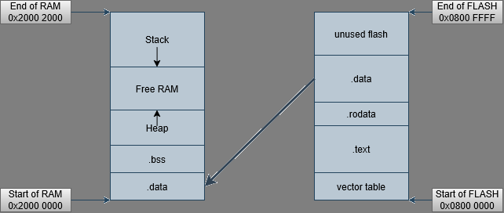
- the copy loop is inside the startup.s file, Reset_Handler.

## But How does it happen?
We now know *what* happens before main() is ever called, but *how* it really happens? how to manually complete the build process and flash programs without the magical tools of an IDE? To understand these questions, we have to understand memory, the purpose of the linker script and the startup file first.

## The Memory
Embedded systems generally have two different memory types. FLASH memory and RAM. Flash is non-volatile, meaning the memory inside is kept after power-loss. RAM is a volatile type memory, it only works when it is properly powered-up.

### FLASH Memory
The target device's FLASH memory start address and the size is known in the Reference Manual.

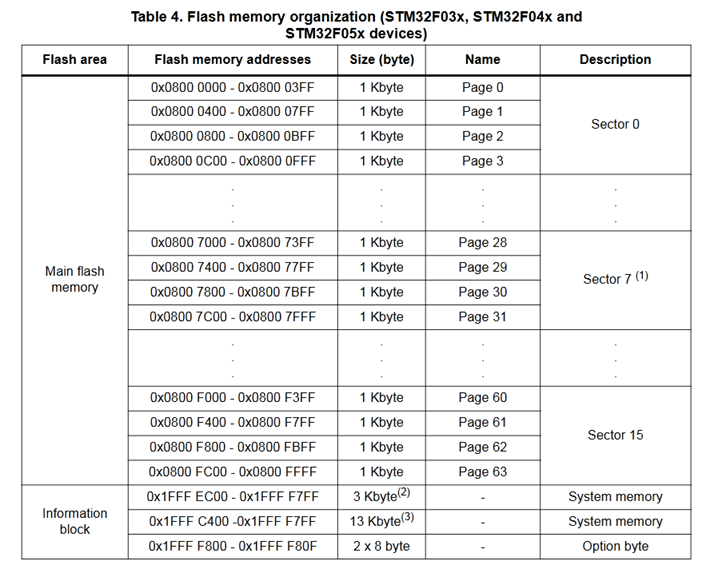

- Our flash starts at the address 0x0800 0000, ends at 0x0800 FFFF. Size is 64K.

### The Segments of Flash Memory
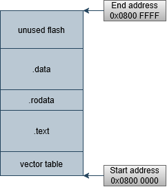

#### The vector table
- Lives at the bottom of the FLASH memory. It is the very first entry and it HAS to be. The vector table itself is the main starting point of the boot process.

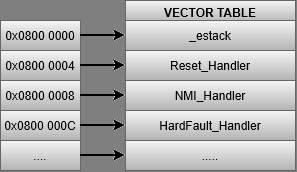

#### .text
- The place where machine code instructions live. The CPU fetches instructions from the .text section. The PC (Program Counter) always holds the address of the next instruction to execute.

#### .rodata
- Holds the read-only program data such as const variables, lookup tables and string literals.

- **example .rodata in C**
```c
const uint8_t key = 34;
```

#### .data
- Holds the initialized variables that will change dynamically on runtime.
- This segment is copied to RAM during reset/power-up, and the values in FLASH memory stays the same, forever. Every time the program restarts, this segment is copied to the .data segment in RAM.

- **example .data in C**
```c
uint8_t counter = 42;
```

### RAM Memory
The RAM is the memory unit that is being used to manipulate data on runtime. The machine instruction code actually does not live on RAM on our cortex-M0 brain. It is because the processor uses Harvard architecture system, in this particular system the CPU fetches the instructions directly from FLASH. Saving precious RAM memory.

### RAM Segments
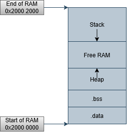

#### .data
- This segment where our initialized variables live, they are copied directly from FLASH memory's ".data" segment. The copying process is done on reset/power-up by the Reset_Handler.

#### .bss
- This is the allocated memory region for uninitialized variables, this section is set to 0 on reset/power-up. Filling the whole segment with 0's is done by the Reset_Handler.

#### Heap
- This section is reserved by the Linker. If the application never uses dynamic memory allocation (malloc(), calloc()), this region remains unused. It is not practical and even banned on some standards to use Heap for safety concerns on embedded devices.

#### Stack
- The stack segment lives directly on top of the RAM. The SP (Stack Pointer) initially points to the end of the RAM memory, which is *0x2000 2000* as shown in the figure.
- On Cortex-M processors, the hardware loads the initial Main Stack Pointer (MSP) from the first entry of the vector table before executing Reset_Handler. It is also industry standard to load the initial MSP on the very first execution inside Reset_Handler, though it is redundant in our code.


## Linker Script
- The Linker takes all independent relocatable object files (`.o`) and combines them into a single executable (`.elf`). It resolves symbol references between files and maps to actual physical memory addresses.
- Without a linker script, the linker has no idea where FLASH or RAM physically live in our target microcontroller.
- The linkerscript.ld file has comments inside, explained line by line.

### The purpose of Linker Script
- *Defines Memory Regions:* Specifies origin addresses and lengths for `FLASH` (`0x0800 0000`) and `RAM` (`0x2000 0000`).
- *Defines Output Sections:* Tells the linker where to place `.isr_vector`, `.text`, `.rodata`, `.data`, and `.bss`.
- *Exports Symbols for Startup:* Generates memory markers (`_sidata`, `_sdata`, `_edata`, `_sbss`, `_ebss`, `_estack`) so our C startup code knows exact boundary locations during memory initialization.

## Startup File
- The startup file includes the first code executed (Reset_Handler()) by the target MCU upon reset. It is written in Assembly or C.

### The Responsibilities of Startup File
- *Vector Table Setup:* Allocates an array of function pointers placed strictly at section `.isr_vector` (address `0x0800 0000`).
- Provides a reset_handler and sets up the runtime environment.
- *Default Handlers:* Provides dummy infinite-loop (e.g. "while(1)") handlers for all system exceptions (NMI, HardFault, SysTick).

## Build Tools & Toolchain
### arm-none-eabi-gcc
- Cross-compiler toolchain targeting our cortex-M0 (arm: processor architecture, none: bare-metal/no OS, eabi: embedded application binary interface, gcc: GNU compiler collection).

### Makefile
- Makefiles automate the entering command process. instead of writing "arm-none-eabi-gcc -c..." every time to compile source files, you write your Makefile once and run the command "make" and it automatically runs the commands. Makefiles automate rule-based compilation pipelines.

### The Compilation, Linking and Flashing process:
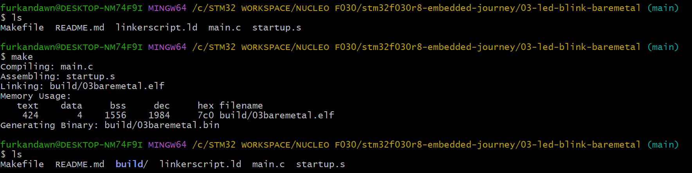
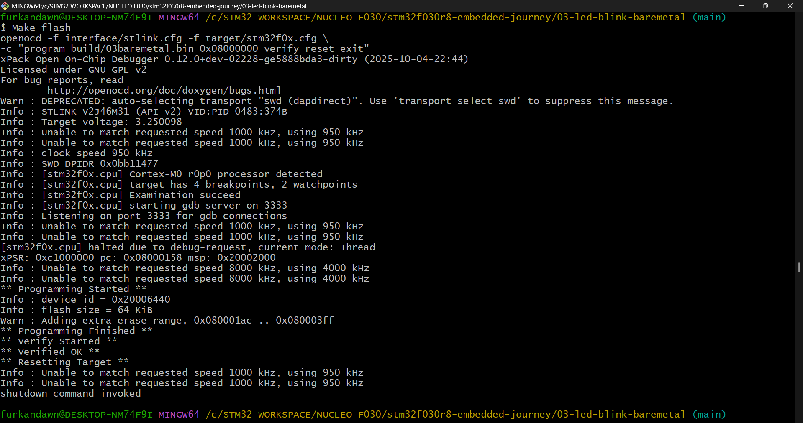

- With the help of the cross-compiler tools I managed to build, link and flash the microcontroller.

### OpenOCD
- *(Open On-Chip Debugger):* Server software that translates GDB commands into hardware-level JTAG/SWD protocol commands.

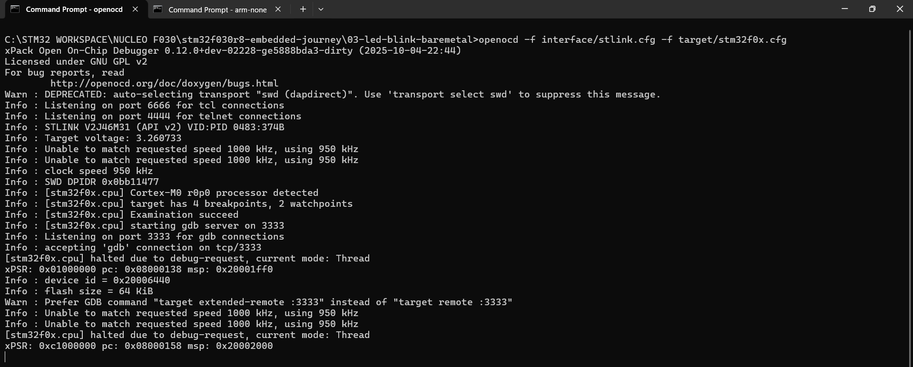
- Initializing OpenOCD and connecting to target device

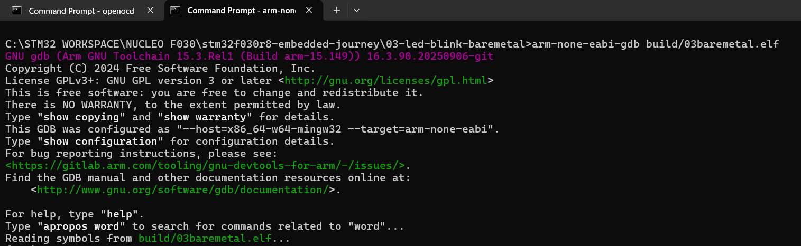
- Initializing GDB

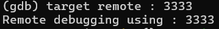
- Listening the target device on port 3333

- In the figures above you can see me initializing openocd on my terminal to investigate the RAM contents, don't forget to check the RAM section under "The Binary Truth" header.

### ST-Link
- Physical hardware programmer/debugger interface, I honestly don't know much about it YET.

## The Binary Truth
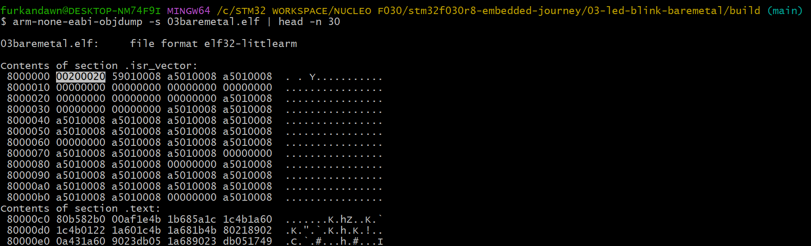

 - In this figure you can see the contents of the .elf file, the very beginning of it. The left column is the address, and each row contains 4 words, each word is in *little-endian* format.

 - The byte order in *little-endian* is *LSB* to *MSB*, basically the 0x1A2B 3C4D value would be 0x4D3C 2B1A if it was in *little-endian* format. Look at the very first entry in our FLASH, address: 0x0800 0000, value 0x2000 2000. This is the address of _estack, the top of RAM, the initial stack pointer, defined in linkerscript as (_estack = ORIGIN(RAM) + LENGTH(RAM)).

 - Also look at the second 4-byte entry, 0x0800 0159, this is Reset vector pointing to Reset_Handler(). If you look closer you will see a value repeated over and over and over again. That is the Default_Handler()'s vector pointing to a *while(1)* loop. The Vector table contents are set to default_handler by default inside startup file, it is the programmer who sets their functionality later.

- This single figure proves that our linker script works just fine, it places each section correctly.

### FLASH Memory Contents
- Moving on to another truth, inside our main.c file I placed three variables.

```c
/* Goes to .data segment (initialized global) in RAM */
uint32_t initialized_variable = 42;

/* Goes to .rodata segment in FLASH */
const uint32_t initialized_constant_variable = 10;

/* Goes to .bss segment (uninitialized global) in RAM */
uint32_t uninitialized_variable[64];
```

- And I deliberately referenced them inside main(), notice that the constant variable is never referenced.

```c
int main(void)
{
	initialized_variable++;
	uninitialized_variable[0] = 1;
```

- Looking the at the following sections inside FLASH, one expects to see the *.data* and the *.rodata* sections, right? Have a look.

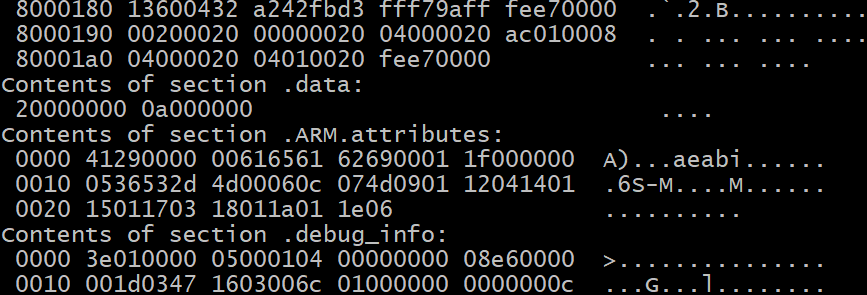

- Contents of section .data: address 0x2000 0000, value 0x0000 000a (10 in decimal).

- We see our "initialized_variable" at the very first entry of our .data section. The address however, seems to be 0x2000 0000 (our RAM .data section start address). The 0x2000 0000 is called VMA (Virtual Memory Address). The actual address this variable lives in FLASH is not known from this objdump output. But, it also lives on FLASH at somewhere like 0x0800 ????. The address it lives in FLASH is called LMA (Load memory address). The Reset_Handler() copies the content from the LMA to VMA on reset/power-up.

- I can't see the .rodata section here, the rest of the output is just metadata (debug info). It is because the linker optimizes the unused references. The const variable in our project was never referenced, the linker runs a *garbage collecting* process on the object files when linking.

### RAM Contents

- I set a temporary breakpoint at the very start of our program so I could walk through every execution starting from the Reset_Handler() function. Let me show you some debug visuals from the GDB commands:

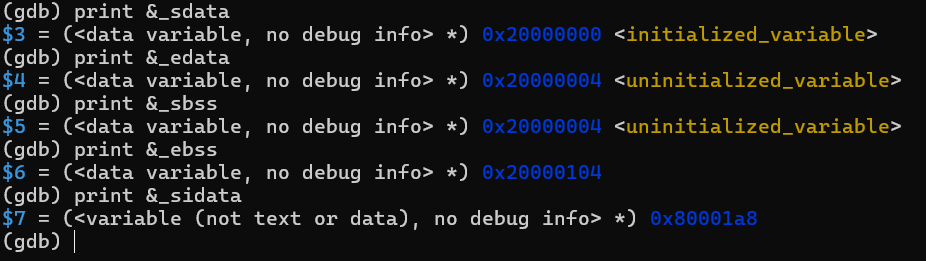

- It shows the address of the start of .data section in RAM (_sdata), and end of .data (_edata)
- You can see _sidata address 0x0800 01a8, this is where our .data values in FLASH memory lives. The LMA address itself mentioned earlier.
- .data section allocates 4 bytes of RAM, just as much as our initialized_variable takes up. Remember it was uint32_t, 4 bytes.
- and .bss section allocates 256 bytes of RAM, as it is needed for the uninitialized 64 entry uint32_t array.

#### The garbage values in RAM
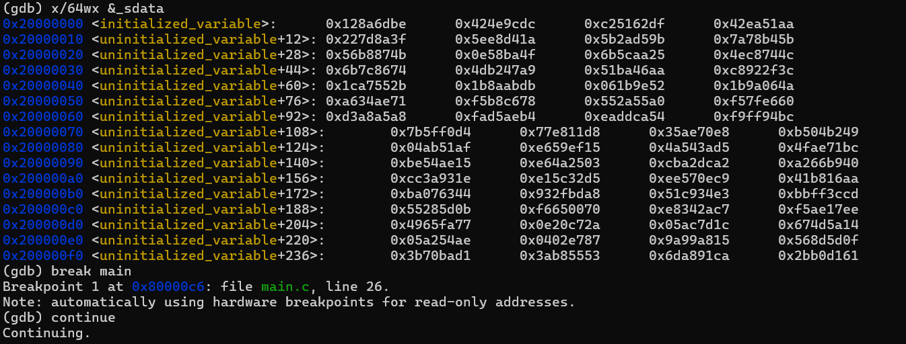

- When our board is powered up, the very first snapshot of our RAM looks like this. Garbage value everywhere. Just a few milliseconds later, the MSP is set and the Reset_Handler is called. Then it looks like this:

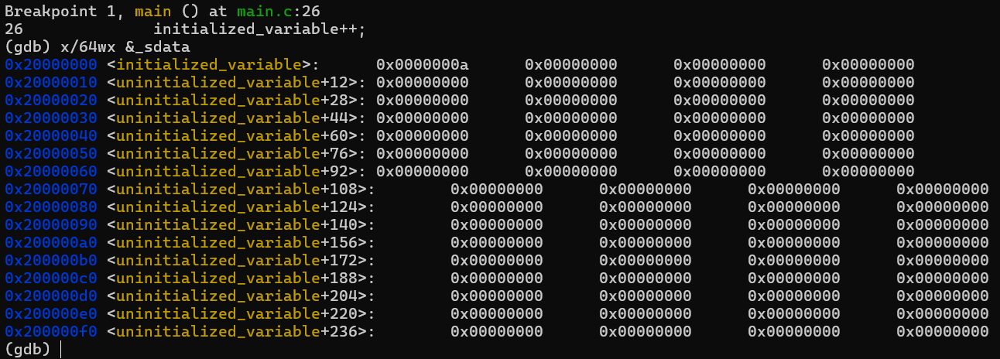

- This is the snapshot of our RAM just before entering the main() function. Remember our code, I incremented the initialized variable and set the 0 index of our uninitialized array to 1. So let's check if that really happened.

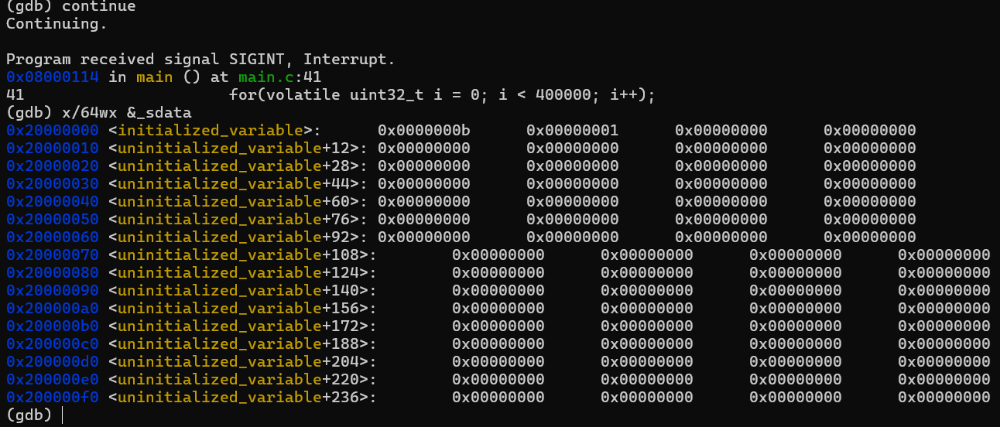

- This is not magic, just Reset_Handler doing it's job. Its last job was to branch to main, and it did. It appears so.

### The ARM Thumb Instruction Set Reality

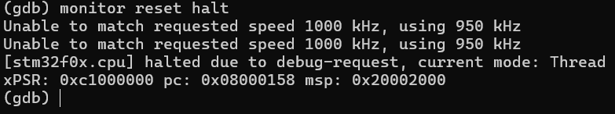

- Remember when we did Hex Dump? The second entry of the vector table was "0x0800 0159", but our actual PC is "0x0800 0158". On ARM Cortex-M processors, the LSB of every function address is not part of the actual memory address. Instead, the LSB is used as a flag telling the processor "execute this in Thumb state". It appears Cortex-M processors only support Thumb instructions, so this bit is set to 1 all the time. The processor loads the address into to PC, ignores the LSB, and begins executing at the actual address.

## Final

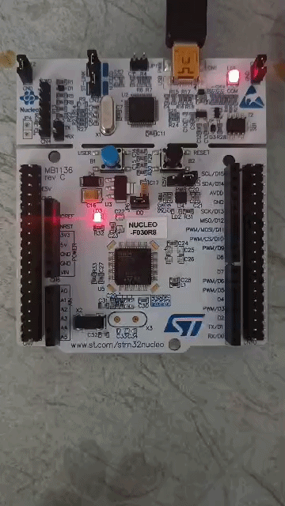

- Our LED finally blinks again, it is telling us something, do you hear it? I do.

- What is happening inside System_Init(), what is a clock tree? 

- On to the next black box. Furkan Şafak