# 04 - System Initialization & Clock Configuration

## About The Project
The project implements the SystemInit() function from scratch to understand how the system clock works. RCC register, PLL configuration, FLASH latency, clock distribution are covered.

## About CMSIS
I used CMSIS register address macros in this project instead of calculating each register address by hand. The CMSIS Device Driver is a zero-cost abstraction, it only converts the actual addresses to macro names.

## What is Clock
- Clock could be imagined as the pulse of the MCU. Most briefly, it is a periodic square wave signal, required for the MCU to execute. On each clock edge, flip-flops sample their inputs and update their outputs. Thus allowing data to propagate through the logic in a controlled and deterministic way.

### Clock Signal
- The clock signal is in a square shape, as shown in the following figure.

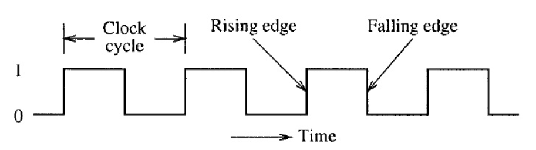

- The crystal oscillator inside MCU produces a sine-like wave. A square wave practically cannot exist. The MCU interprets the signal using input voltage thresholds, thus creating square shape. Because it needs logic high and logic low, basically 0 and 1.

- The gray area between the thresholds is the undefined area. The MCU relies on the signal passing through this zone as fast as possible.

### Clock Sources
- Crystal oscillators are used to produce the clock physically.

- There are different type of clock sources such as HSI/HSE (High-Speed Internal/External), LSI/LSE (Low-Speed Internal/External). Each clock source has its ups and downs.

### The Default Clock Source On Power-Up
- The default clock source is almost always the HSI, it is built INSIDE the microcontroller directly.

### HSI (High-Speed Internal)
- HSI is configured as the main clock source automatically by hardware on power-up/reset. It does not require physical pins like OSC_IN or OSC_OUT, like it is necessary in HSE or external sources.

- For it is inside the microcontroller itself, it is easily affected by the heat the MCU produces. It is not as stable as external sources.

### PLL (Phase-Locked Loop)
- The PLL is an analog circuit, this is not a direct clock source, but a frequency modifier. It needs to be fed a clock source, to match it with the desired clock speed.

## Clock Tree
- The clock tree of our board is shown in the figure
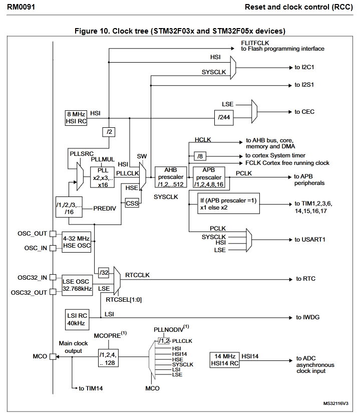

- In this project, I used PLL to maximize CPU speed. I fed the PLLSRC (PLL Source) multiplexer with HSI directly. There is not an external source or a HSE involved.

### The Flow
- The clock is distributed through the whole system, multiplexers select clock sources while clock gates enable/disable clocks for individual peripherals.

- In our system, STM32F03x, I selected HSI as the input source of PLLSRC multiplexer, which routes through a /2 divider to feed 4 MHz into the PLL block. And then, multiplied by a number chosen by the developer to feed the SW (System clock switch) multiplexer. The output of this multiplexer is called SYSCLK.

### SYSCLK, HCLK, PCLK
- SYSCLK is the master clock that's chosen by the RCC_SW register, HCLK is a prescaled version of SYSCLK that is used in the AHB peripherals while PCLK is another prescaled version used in the APB peripherals. HCLK is what determines the core's execution speed.

### ADC Clock
- Notice in the clock tree figure, there are isolated clock sources such as HSI14. ADC has its own clock source, because it has different timing requirements than the CPU. That being said, also the SYSCLK could be changed during runtime. If SYSCLK fed ADC directly, then ADC sampling rate or conversion times would also change undesirably during runtime.

### IWDG (Independent WatchDog)
- IWDG stands for Independent WatchDog, it is seperated from the SYSCLK for safety. If for any reason, the clock fails, then IWDG triggers a reset to recover the system. If, this watchdog depended on the SYSCLK, then it would not be able to trigger the reset when the clock failed.

### RTC Clock
- System's calendar, keeps both time seconds/minutes/hours and day/month/year. It has its own small power supply, so it never runs out of power even when the main system power is off for years.

## Clock Gating & Power Optimization
- Clock gates must be enabled to let the clock get through the desired peripheral. On default, all the clock gates are disabled to save power. Developer must enable the clock gate to wake up the peripheral.

### How MCU Consumes Power
- Most of the energy is consumed when the internal transistors switch states, the transistors switch states with the clock's rising edge in our system. So basically the clock frequency determines how much energy is used overall.

### How To Save Power
- Disabling the unused peripherals save the most of the power. Though, designing a system where you use a peripheral in a period, and then triggering the clock gate of the peripheral to enable clock just as the peripheral needs it is another way of power optimization. Or lowering the frequency when the operation does not need high clock speeds, and speeding it up just as much as it needs. It takes clever system designs to plan the whole structure.

- Using RTC to wake the system-up periodically, like once an hour. Gathering data via sensors, processing, doing whatever the system is supposed to do, and then going back to sleep again. Standby mode is also a way to design low-power systems.

- Different peripherals can run at different clock frequencies for power optimization.

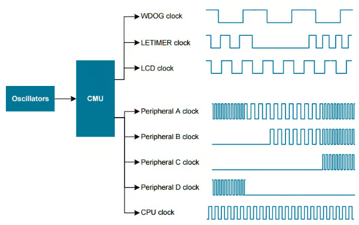

## RCC Registers (Reset Clock Control)
- The whole clock configuration depends on this register, there are also read only registers that changed by the hardware itself to check the current system states.

### RCC_CR
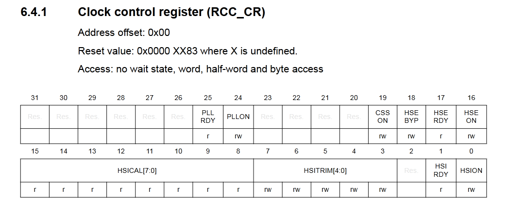

- Turning on the HSI/HSE/PLL and checking if they are stable enough to power the clock is done with this register.
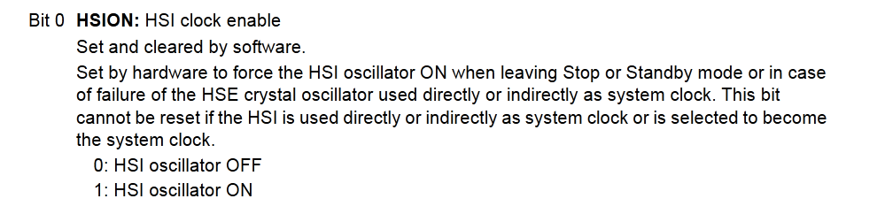
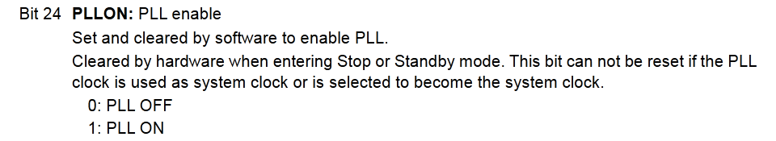

- RDY bits are read only, they are set by hardware. The bits tell exactly whether the source is stable.
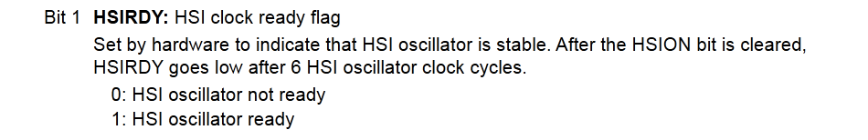
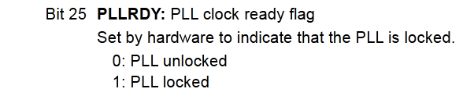

### RCC_CFGR
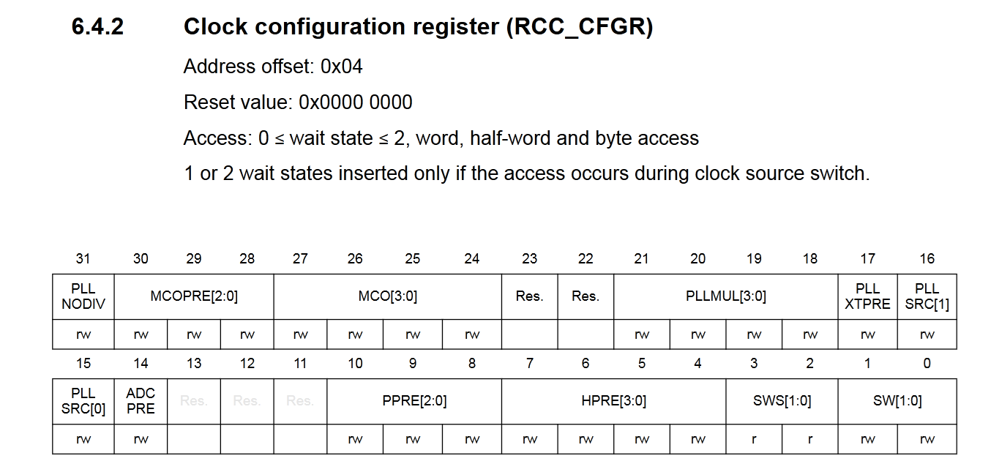

- Setting/Checking the current system clock source, configuring the PLL parameters, setting up the prescalers of AHB and APB is done with this register.

## Clock Switching
- Clock sources can be switched during runtime. I switched to PLL 48 MHz inside SystemInit function that is called by Reset_Handler.

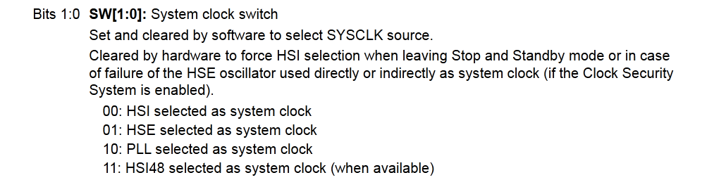

### Disabling and Enabling The PLL
- In order to switch to PLL, it must be disabled first. The multiplication factor of PLL (pllmul) can only be modified when PLL is off.

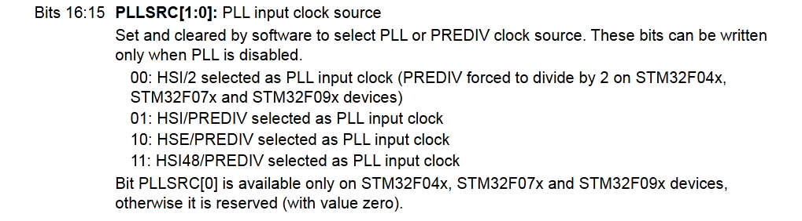

```c
void ClockSwitchToPLL48MHz(void)
{
	/* Ensure HSI is enabled and ready */
	RCC->CR |= RCC_CR_HSION;
	while(!(RCC->CR & RCC_CR_HSIRDY));

    /* Disable PLL to configure it */
    RCC->CR &= ~RCC_CR_PLLON;
    while ((RCC->CR & RCC_CR_PLLRDY));

    /* Configure PLL multiplication factor (x12) */
    RCC->CFGR &= ~RCC_CFGR_PLLMUL;
    RCC->CFGR |= RCC_CFGR_PLLMUL12;

    /* Set PLL source to HSI/2 */
    RCC->CFGR &= ~RCC_CFGR_PLLSRC;
    RCC->CFGR |= RCC_CFGR_PLLSRC_HSI_DIV2;

    /* Set FLASH Latency to one wait state (24 MHz < SYSCLK < 48MHz) */
    FLASH->ACR &= ~FLASH_ACR_LATENCY;
    FLASH->ACR |= FLASH_ACR_LATENCY;
    
    /* switch on prefetching */
    FLASH->ACR |= FLASH_ACR_PRFTBE;

    /* Enable PLL back */
    RCC->CR |= RCC_CR_PLLON;
    while (!(RCC->CR & RCC_CR_PLLRDY));

    /* Set PLL as system clock*/
    RCC->CFGR &= ~RCC_CFGR_SW;
    RCC->CFGR |= RCC_CFGR_SW_PLL;
    while ((RCC->CFGR & RCC_CFGR_SWS) != RCC_CFGR_SWS_PLL);

    SystemCoreClockUpdate();
}
```

- This function is called inside SystemInit() function which is called during Reset_Handler() on boot. Check the system.c file inside project folder.

- The while loops ensure a stable clock source, the clock switching is not instantaneous. When the clock source is stable and ready, the software breaks through the while loops and keeps executing.

### SystemCoreClock
- This variable is a software representation of our hardware. In case software needs to know how fast our CPU is, this variable is used.

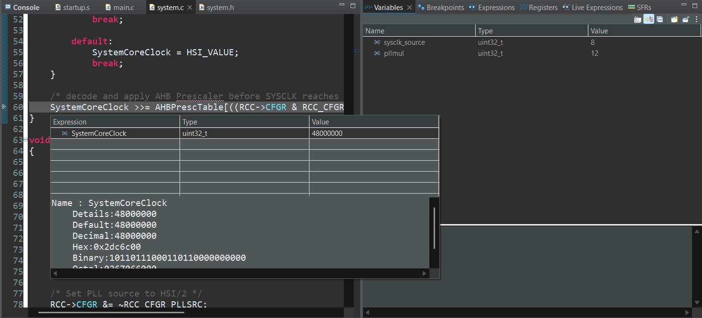

- It is set to 48MHz after switching to PLL x12 multiplication factor with HSI/2 clock source.

### Decoding The Encoded Registers
- In the vendor SystemCoreClock update function, I came across a few decoded bit fields. Such as:

```c
/*!< AHB prescalers table values */
const uint8_t AHBPrescTable[16] = {0, 0, 0, 0, 0, 0, 0, 0, 1, 2, 3, 4, 6, 7, 8, 9};
```
- The original corresponding data for this table in the Reference Manual is this.

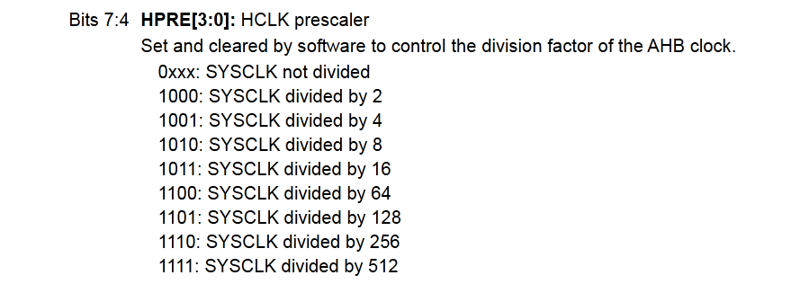

- AHB prescaler table and APB prescaler table contain the encoded division factors. Instead of storing the direct division numbers, they are encoded to save space and optimization.

- For the AHB case, the decimal numbers are stored as the power of 2, power of 2^9 means 512. And shifting a binary number right by one means dividing it with 2, while shifting it right 9 times means dividing it with 512.

- With this encoding, instead of doing heavy math and bottlenecking ALU, we only shift some bits inside the registers directly. This saves both memory and clock cycles.

- **PLLMUL** is also encoded in a different and a clever way.

- Each multiplication factor is stored as (multiplication factor - 2). To decode it, we move the bits to the LSB first --if the pllmul bits start at the 18th bit we shift them right 18 times. Then we treat it as a decimal number and add two.

```c
pllmul = ((RCC->CFGR & RCC_CFGR_PLLMUL) >> 18) + 2;
```

- This gives us pllmul = 12; and then used like this.

```c
/* PLL input is HSI divided by 2, then multiplied by PLLMUL */
SystemCoreClock = (HSI_VALUE >> 1) * pllmul;
```

## FLASH Latency
- The FLASH needs time to be read. The CPU's request to read and the time passed until it is read is called the FLASH Latency.

### What Happens If CPU is Faster Than FLASH
- If CPU tries to fetch data from FLASH faster than FLASH can respond, the program will crash, perform undefined behavior or hardfault.

### FLASH_ACR
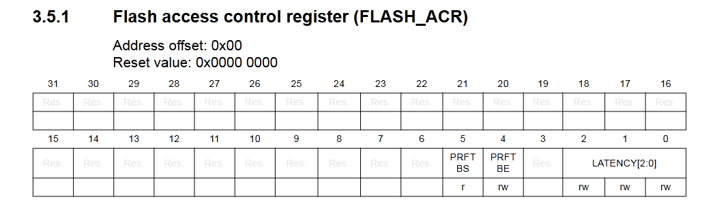

- The main approach to solve the FLASH Latency is to set a wait state. With the wait state set, the CPU spends more cycles to read FLASH when it can read FLASH in one cycle.

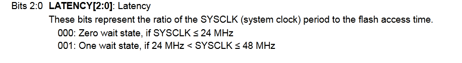

- Our CPU can go up to 48MHz at maximum, So there are only two different wait states available.

- We can also have the CPU fetch the next instruction while executing the current one. This is called prefetching, and enabled/disabled inside FLASH_ACR register.

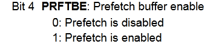

## Debugging Session
- I used the STM32CubeIDE's debugging tools to watch the registers change live and verify the modifications.

- The IDE itself is extremely useful if you know how to use it. One can inspect the registers and variables line by line.

### Letting The Hardware Set Up MSP
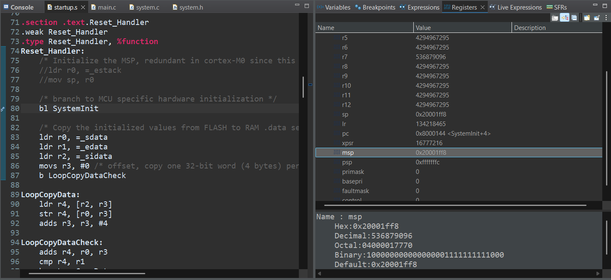

- In the previous project, 03-boot, I mentioned that MSP is set by the hardware already and setting it up inside Reset_Handler is actually redundant. And I also said it is the standard way of doing things. I disabled the Reset_Handler's MSP functionality and watched the hardware set up the stack pointer itself.

### Watching The Registers
- Some snapshots of my debugging session and the exact points our CPU is at.

- Notice the HSI is already switched on even before entering the SystemInit function, that is the default clock set by hardware.

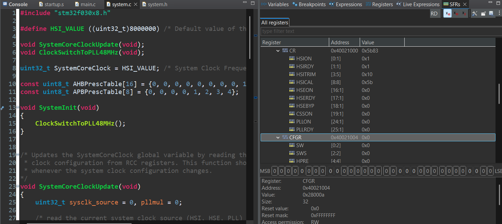

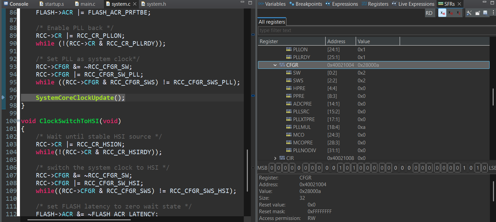

### Notes
- Clock enable registers are used to enable/disable the gates, they do not reset the states of the peripherals. Once the clock pulse is enabled through a gate, whenever the developer disables it the internal state of the peripheral also needs a reset. So, disabling the clock gate is not enough, the reset (RSTR) registers must also be used.

## FINAL
- And now clock tree is not that mythical anymore, it's just some multiplexers, crystal oscillators and cleverly designed railways.
- See you on the next mythical black box.
- Furkan Şafak