# 05 - Timers & PWM
<video src="https://github.com/user-attachments/assets/16c313e6-7cc7-4d5e-92a6-417e2787550d" autoplay muted width="100%">
</video>

## About The Project
Drives 4 LEDs by a single advanced Timer using the Alternate Function mapping of GPIO. STM32 peripheral timers, ISR, update events, deterministic timing, PWM and __WFI() concepts are touched and practiced.

## What is a timer
A timer is a hardware peripheral that increments or decrements its counter independently of the CPU in response to its input clock.

### How a timer counts
For a timer to count, it needs clock. The hardware flip-flops automatically increments the register with each incoming clock rising edge. The flip-flops increment or if configured that way decrement the counter register.

### SysTick vs Peripheral Timers
- Peripheral timers are the vendor timers of STM32, they are routed to the other peripherals. Their signals can be connected to GPIO pins through the GPIO Alternate Function system. Which is, done exactly in this project.

- SysTick is ARM's core timer. Unlike other timers, it is the only timer inside the CPU core and it is not routed to anywhere. It is commonly used for task scheduling in systems with RTOS and millisecond timekeeping. SysTick is always 24-bit in ARM-Cortex M architecture, while vendor timers can be 16 to 32 bit depending on the MCU.

- I didn't touch SysTick in this project, though planning to touch it later in other projects. 

### The most basic form of a timer
A basic timer can be understood through three fundamental concepts: a prescaler, a counter and a reload value.

- When the amount of rising clock edges, in other words the counter register value, match the reload value the counter automatically resets and starts counting from 0 if it is in upcounting mode. In downcounting mode, counter starts from the reload value and counts down to 0 and then repeats.

### Use cases of timers
Timers could be used in a lot of cases, from Non-CPU blocking accurate delays to task scheduling, PWM generation to event captures/interrupt generations.

- I used two timers for PWM and interrupt generation in this project.

- Here are some upcounting timer diagrams to roughly demonstrate how a timer works.

- Timer used for interrupt/event generation
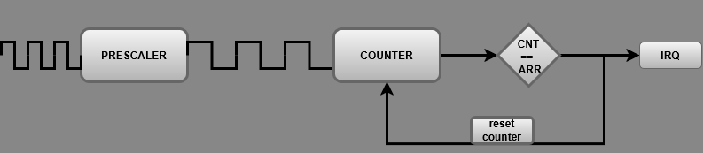

- Timer used for capture/compare mode in the figure below.
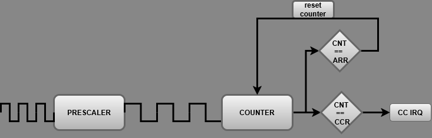

- Timer used for PWM generation in the figure below
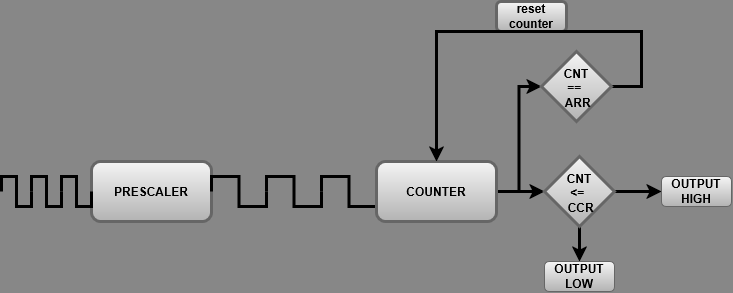

## Timer Registers
A bunch of registers that are used in the project briefly mentioned

### Timebase Registers
- `TIMx->PSC` (Prescaler): Divides the incoming clock to produce the counter clock frequency.
- `TIMx->CNT` (Counter): The live counting register incrementing (or decrementing) on every clock tick.
- `TIMx->ARR` (Auto-Reload Register): Defines the counter ceiling/period before it resets and triggers an Update Event.

### Capture / Compare Registers
- `TIMx->CCR1`-`CCR4`: Channels 1 to 4 match registers. Holds duty-cycle threshold in PWM mode, or the next toggle target in Output Compare mode.
- `TIMx->CCMR1` / `CCMR2` (Capture/Compare Mode Registers): Selects active modes such as PWM and output toggle or output set/reset.
- `TIMx->CCER` (Capture/Compare Enable Register): Enables physical output drive to internal multiplexers (`CCxE`).

### Control & Interrupt Registers
- `TIMx->CR1` (Control Register 1): Counter Enable (`CEN`), Auto-reload Preload Enable (`ARPE`), and counting direction (upcounting/downcounting).
- `TIMx->DIER` (DMA/Interrupt Enable Register): Local peripheral gate for interrupts (`UIE` for update events, `CCxIE` for capture-compare matches). If not enabled, update events will not trigger IRQ.
- `TIMx->SR` (Status Register): Latching flags set by hardware (`UIF`, `CCxIF`). Must be cleared in software inside the ISR or interrupts/events will be triggered constantly.
- `TIMx->BDTR` (Break and Dead-Time Register): Master Output Enable (`MOE`) required on Advanced Timers (`TIM1`) to pass signals to physical pins.

### Registers in the Reference Manual
The most important configuration of TIM1 is demonstrated below. On each state change upon TIM16 IRQ, TIM1 is reconfigured to PWM and toggle modes.

- The PWM mode
- 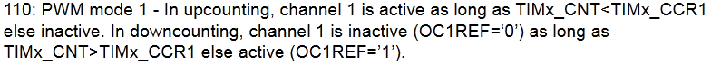

- The toggle mode
- 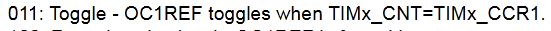

- The reset helper used in each reconfiguration to prevent status overflow between modes
- 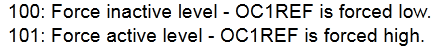

## Designing a System
- I used 4 LEDs and decided to create a simple two state system.

- Only two timers used, TIM1 (advanced timer) and TIM16 (general purpose timer).

- TIM1 drives the LEDs.

- TIM16 decides when it is time to switch between modes and reconfigures TIM1.

### State Machines
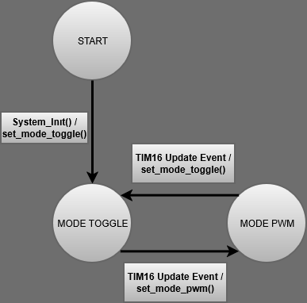

- The two states of the system after the startup, toggle mode and PWM mode.

### System Architecture
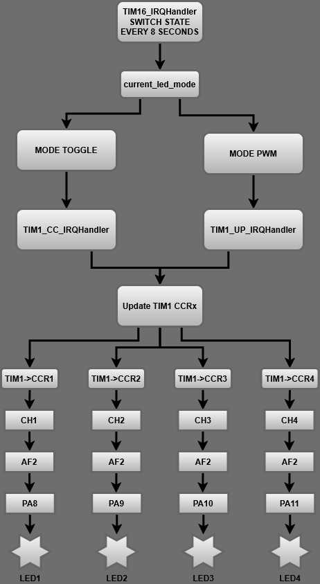

- The system architecture is roughly something like in the figure above. Each GPIO pin is fed through the TIM1 channels by using the alternate function hardware paths. GPIO pins aren't modified manually.

### TIM16 General Purpose Timer
TIM16's purpose is to periodically fire an interrupt service routine (ISR) to change the system state and reconfigure TIM1.

```c
void TIM16_IRQHandler(void) {
    /* clear the interrupt flag, if not this ISR will be called forever */
    TIM16->SR &= ~TIM_SR_UIF;

    if (current_led_mode == MODE_BREATHING)
    {
        current_led_mode = MODE_TOGGLE;
        set_mode_toggle();
    }
    else
    {
        current_led_mode = MODE_BREATHING;
        set_mode_pwm();
    }
}
```

### TIM1 Advanced Timer
This timer has 4 individual channels, and each channel is connected to a specific GPIO pin(s) mapped in the datasheet.

- in PWM mode, every 20ms an interrupt happens and calls TIM1_BRK_UP_TRG_COM_IRQHandler right from the vector table. It updates the duty cycle of each channel.

- in Toggle mode, each channel capture compare value independently fire their own compare events (CCxIF) by another interrupt request (IRQ), TIM1_CC_IRQHandler. Each channel output set high/low by hardware directly using the CCMR registers OCxM bit's toggle mode.

- BDTR is an advanced timer specific register, must be enabled for output flow.
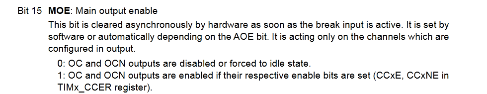

- CCER is needed in toggle mode, each channel counter triggers an *compare event* (CCxIF) upon reaching the CC register value.
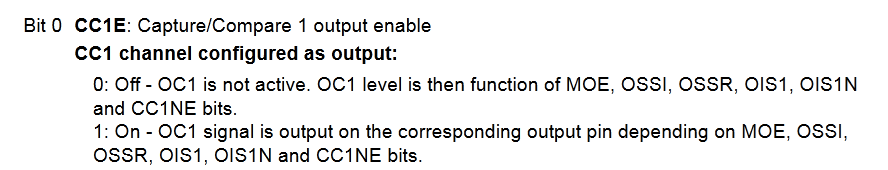

- EGR to update the timer configuration immediately.
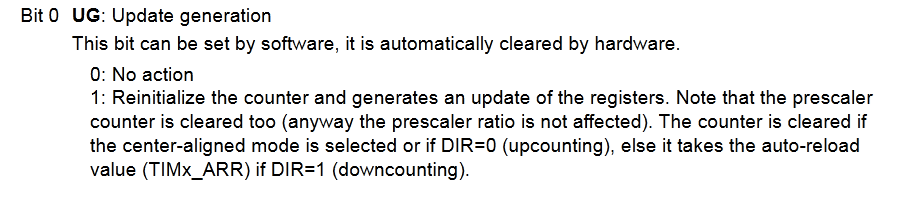

### Architecture Decisions
While trying to design a system from scratch, I initially planned to use 4 different timers. Running PWM from a solely independent timer. Then decided to use another timer to fire interrupts for each pin and manually configure GPIO outputs, and to do that so I needed another timer etc. As I read more about the TIM1 and its functionalities, I wanted to see if it is possible to do it with only one timer. That's when I figured out TIM1 has enough capability alone for the whole project.

## Implementation
The implementation process is roughly like this

### GPIO Initialization
Notice there is not any direct manipulation of GPIO pin outputs to drive the LEDs, because TIM1 drives itself.

```c
void gpio_led_init(void) {
    /* Enable GPIOA Clock */
    RCC->AHBENR |= RCC_AHBENR_GPIOAEN;

    /* Set Alternate Function mode (10) */
    GPIOA->MODER &= ~(GPIO_MODER_MODER8 | GPIO_MODER_MODER9 | GPIO_MODER_MODER10 | GPIO_MODER_MODER11);
    GPIOA->MODER |= (GPIO_MODER_MODER8_1 | GPIO_MODER_MODER9_1 | GPIO_MODER_MODER10_1 | GPIO_MODER_MODER11_1);

    /* Map PA8-PA11 to AF2 (TIM1_CH1 - TIM1_CH4) in AFRH (AFR[1]) */
    GPIOA->AFR[1] &= ~((0xFU << 0) | (0xFU << 4) | (0xFU << 8) | (0xFU << 12));
    GPIOA->AFR[1] |= ((0x2U << 0) | (0x2U << 4) | (0x2U << 8) | (0x2U << 12));
}
```

- The silicon connection on MCU is mapped in the datasheet. Alternate function maps show which peripheral connected to GPIO in which silicon (AF1-AF4). our PA8-PA11 GPIO pins are connected to TIM1's channels through AF2.

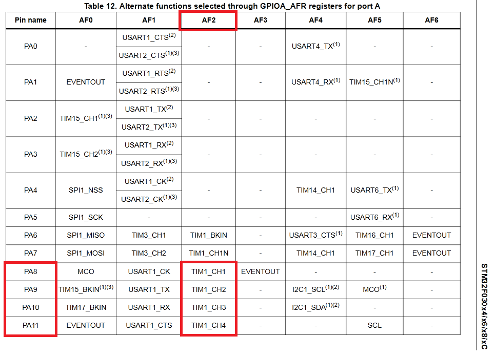

### TIM16 & TIM1 Initialization
Each timer's initialization is inside effect_timer.c source file. TIM16 uses the set_mode_x methods to reconfigure the TIM1.

- On each reconfiguration, the Timer and the Update/Interrupt event generation is disabled temporarily to prevent IRQs mid configuration.

- Then the timer is updated immediately, and the UIF is reset ensure there isn't any interrupt/event pending.

```c
TIM1->EGR |= TIM_EGR_UG;
TIM1->SR &= ~TIM_SR_UIF;
```

- Forcing an update event (EGR_UG) reloads the prescaler immediately, but hardware also sets UIF. If UIF is not cleared, as soon as the Update/Interrupt events are enabled back a phantom interrupt happens.

- Clearing SR right after prevents an unwanted interrupt when the update interrupt is later enabled.

### The Sleeping CPU
CPU only waits for the interrupts/events. The project is solely an event/interrupt driven one. inside main(), only the timers and the GPIO is initialized. __WFI() (wait for interrupt) puts the CPU in sleep.

```c
int main(void)
{
	gpio_led_init();
	mode_timer_init();
	effect_timer_init();
	
	while(1)
	{
		__WFI();
	}
}
```

## Debugging
Though I walked through register debugging on my own using the CubeIDE, I don't want to dump snapshots here of the register values. I did that once in the previous project, won't be a second time.

### Analyzing the signals with an oscilloscope
- Here is a capture of the changing PWM signals on my DSO2150 USB oscilloscope.

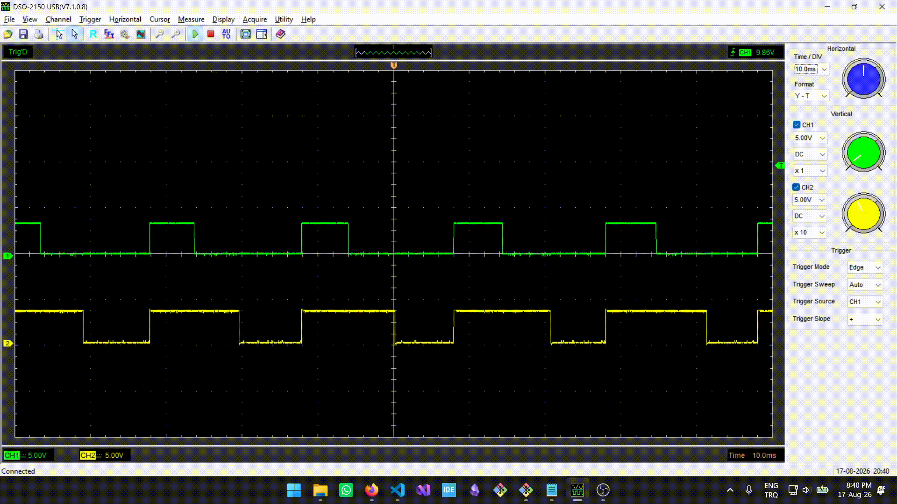

- Since there are only 2 channels, only PA10 and PA11 observed in the figure.

- The 20ms period (50 Hz) can be validated through the figure below, each dot square-section is 20ms.

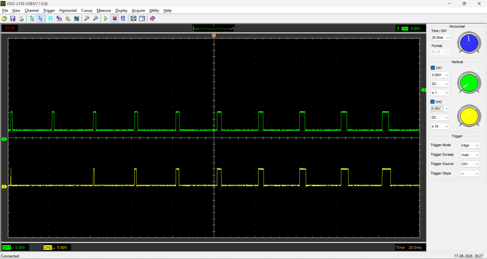

### Faced Problems & Debugging Stories

1. **Register Preload (`OCxPE`) Hazard in Toggle Mode**
- *Issue:* Compare target updates (`TIM1->CCR1 += step`) inside `TIM1_CC_IRQHandler` were not taking effect immediately, breaking independent pin frequencies.
- *Root Cause:* Preload buffers were active, causing the hardware to hold the new `CCR` value in a shadow register until a full `ARR` overflow occurred.
- *Resolution:* Disabled Preload (`OCxPE = 0`) in Toggle mode for instantaneous compare updates, while keeping Preload enabled (`OCxPE = 1`) in PWM mode to prevent waveform glitches during duty-cycle stepping.

2. **Prescaler Update Latency on Mode Switch**
- *Issue:* When switching between 1 kHz (Toggle) and 1 MHz (PWM), the timer ran at the incorrect frequency during the initial cycle.
- *Root Cause:* The `PSC` register is buffered and only modified on the first Update Event (`UEV`).
- *Resolution:* Triggered a software update event (`TIM1->EGR |= TIM_EGR_UG`) immediately after reconfiguring `PSC`.

3. **Unwanted update event during each reconfiguration**
- *Issue:* Mid reconfiguration of TIM1, a phantom (unwanted) interrupt/event fired.
- *Root Cause:* Triggering software update event via (`TIM1->EGR |= TIM_EGR_UG`) sets the  (`TIM_SR_UIF`) flag.
- *Resolution:* Cleared `TIM_SR_UIF` to flush pending flags.

### Notes to self

**1**
- Making ISR functions such as TIM16_IRQHandler static will give build-time errors/warnings. Do not do that. Your startup code and vector table expects a symbol with that name.

**2**
- CMSIS bit-mask macros do not perform runtime calculations. The preprocessor replaces them with compile-time constants.
Every value in (GPIO_MODER_MODER8_1 | GPIO_MODER_MODER9_1 | GPIO_MODER_MODER10_1 | GPIO_MODER_MODER11_1) is a compile-time constant, known before program ever runs.

- By the time program actually executes, that line has become something functionally identical to:
GPIOA->MODER |= 0x00000A00; // or whatever the actual combined hex value is

**3**
- To prevent any future pain, check your peripheral properly.
- Understand the physical-hardware boundaries.
- Rely on debugging feedback, not guessing.

## Final
- MCU Timers are rich in context, it is difficult to demonstrate each functionality inside a repo like this. I am planning to do more projects with PWM and possibly motor control, but I will end it here for now.

- NVIC and the interrupts await us.

- Onto the next black box. Furkan Şafak.